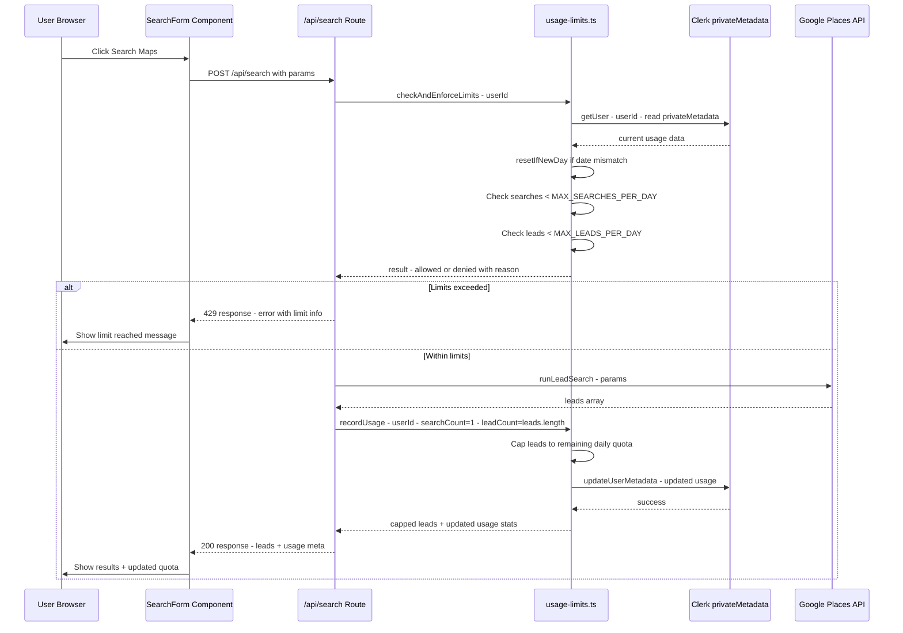

# Daily Usage Limits Feature — Implementation Plan

## Overview

Add per-user daily limits: **5 searches/day** and **20 leads/day** after login. These are hard caps enforced server-side, with UI feedback showing remaining quota.

## Architecture Decision: Clerk `privateMetadata`

Since the project has **no database** (empty `prisma/` directory, no DB dependency) and already uses **Clerk** for auth, we'll store usage counters in Clerk's `privateMetadata`. This gives us:

- **Server-side only** — users cannot read or tamper with counters
- **Per-user** — tied to Clerk user ID, works across devices
- **No infrastructure cost** — no need to add Prisma/PostgreSQL just for two counters
- **Simple API** — `clerkClient.users.getUser()` / `clerkClient.users.updateUserMetadata()`

### Data Shape in `privateMetadata`

```json
{
  "usage": {
    "date": "2026-06-09",
    "searches": 3,
    "leads": 15
  }
}
```

When `date` differs from today, counters reset to `0` and `date` updates to today.

## Search Flow with Limits



## Files to Create/Modify

### 1. `lib/usage-limits.ts` — NEW

Core server-side limit logic module:

- **`getEnvLimits()`** — Read `MAX_SEARCHES_PER_DAY` and `MAX_LEADS_PER_DAY` from env, default to 5 and 20
- **`getUserUsage(userId)`** — Read `privateMetadata.usage` from Clerk, return `{ date, searches, leads }` or defaults
- **`resetIfNewDay(usage)`** — If `usage.date !== today`, reset counters to 0
- **`checkLimits(userId)`** — Get usage, reset if new day, return `{ allowed, reason, searchesUsed, searchesRemaining, leadsUsed, leadsRemaining }`
- **`recordUsage(userId, searchIncrement, leadIncrement)`** — Update Clerk privateMetadata with new counts after a successful search
- **`capLeadsToRemaining(leads, remainingQuota)`** — Truncate leads array to remaining daily quota

Uses `clerkClient` from `@clerk/nextjs/server` and `getEnvInt` from `lib/utils.ts`.

### 2. `app/api/usage/route.ts` — NEW

GET endpoint returning current usage stats for the signed-in user:

- Authenticate via `auth()`
- Call `checkLimits(userId)` 
- Return JSON: `{ searchesUsed, searchesRemaining, leadsUsed, leadsRemaining, maxSearches, maxLeads, resetAt }`
- `resetAt` = midnight UTC of the next day — when counters reset

### 3. `app/api/search/route.ts` — MODIFY

Add limit enforcement before and after search:

- **Before search**: Call `checkLimits(userId)` — if not allowed, return 429 with `{ error, limitType: "searches" | "leads" }`
- **After search**: Call `recordUsage(userId, 1, leads.length)` and `capLeadsToRemaining(leads, remaining)` 
- Add `usage` field to response JSON: `{ searchesRemaining, leadsRemaining }`

### 4. `lib/types.ts` — MODIFY

Add new interfaces:

```typescript
export interface UsageData {
  date: string;
  searches: number;
  leads: number;
}

export interface UsageStats {
  searchesUsed: number;
  searchesRemaining: number;
  leadsUsed: number;
  leadsRemaining: number;
  maxSearches: number;
  maxLeads: number;
  resetAt: string; // ISO timestamp when counters reset
}
```

### 5. `components/UsageIndicator.tsx` — NEW

Client component showing remaining quota:

- Fetches `/api/usage` on mount and after each search
- Displays: `3/5 searches remaining` and `12/20 leads remaining`
- Color-coded: green when plenty, yellow when low, red when exhausted
- Compact design suitable for header bar
- Uses `useEffect` + `fetch` with Clerk auth state

### 6. `components/SearchForm.tsx` — MODIFY

- Fetch usage stats on mount via `/api/usage`
- **Disable search button** when `searchesRemaining === 0` or `leadsRemaining === 0`
- Show warning text when limits are low: *You have 1 search remaining today*
- After successful search, update local usage state from response `usage` meta
- Show error message when 429 response received

### 7. `components/AppHeader.tsx` — MODIFY

- Import and render `UsageIndicator` for signed-in users
- Place it between the logo and the user button in the header bar

### 8. `.env.example` — MODIFY

Add two new env vars:

```
MAX_SEARCHES_PER_DAY=5
MAX_LEADS_PER_DAY=20
```

### 9. `.env.local` — MODIFY (user action)

User needs to add the same vars to their `.env.local`

## Edge Cases to Handle

1. **New day reset**: When `usage.date` in Clerk metadata doesn't match today, reset all counters to 0
2. **First-time user**: No `usage` key in `privateMetadata` — treat as `{ date: today, searches: 0, leads: 0 }`
3. **Lead capping**: If user has 5 leads remaining and a search returns 20 leads, only return 5 and count 5
4. **Concurrent requests**: Clerk metadata updates are atomic per user — no race condition risk for single user
5. **Search with 0 leads remaining**: Block the search entirely — no point running it if no leads can be returned
6. **Export endpoints**: The export CSV/JSON/PDF/Word routes should also check lead limits — but since leads are already capped at search time and stored in localStorage, exports of already-viewed leads are fine. No additional enforcement needed on export.

## UI Behavior Summary

| State | Search Button | Message |
|-------|--------------|---------|
| Searches remaining = 0 | Disabled, grey | *Daily search limit reached — resets at midnight* |
| Leads remaining = 0 | Disabled, grey | *Daily lead limit reached — resets at midnight* |
| 1 search remaining | Enabled, yellow accent | *1 search remaining today* |
| 1-5 leads remaining | Enabled | *Only N leads can be viewed this search* |
| Plenty remaining | Enabled, normal | No special message |

## Implementation Order

1. `lib/types.ts` — Add `UsageData` and `UsageStats` interfaces
2. `lib/usage-limits.ts` — Core limit logic with Clerk integration
3. `app/api/usage/route.ts` — Usage stats endpoint
4. `app/api/search/route.ts` — Add enforcement to existing search route
5. `components/UsageIndicator.tsx` — Quota display component
6. `components/SearchForm.tsx` — Integrate usage checks and UI feedback
7. `components/AppHeader.tsx` — Add UsageIndicator to header
8. `.env.example` — Add new env vars