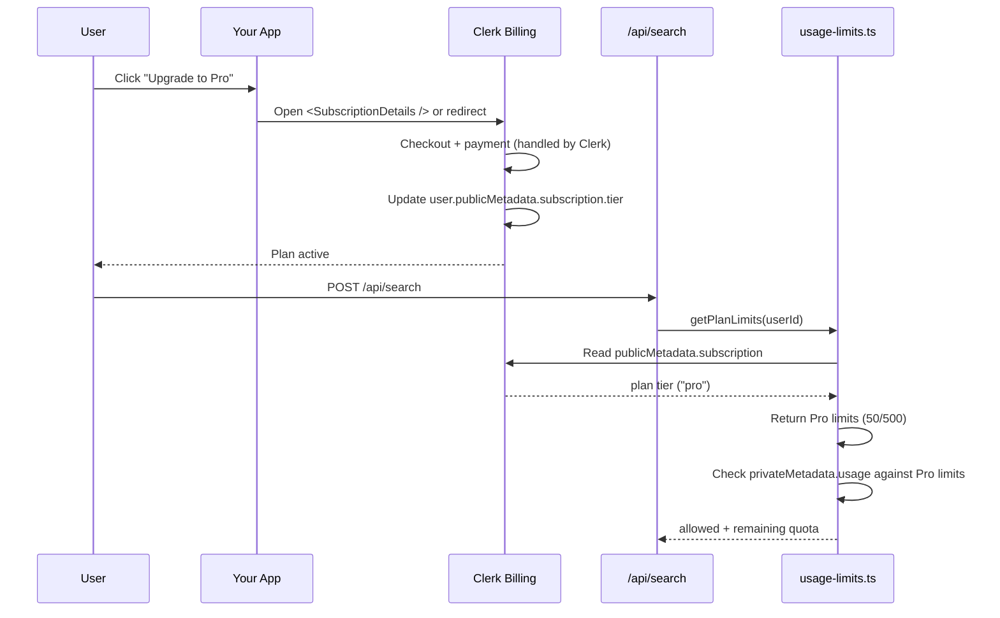

# Pricing Tiers Feature — Free / Pro / Enterprise

## Overview

Introduce three subscription tiers that replace the current single-tier usage limits. Each tier gets different daily search/lead quotas, feature access, and pricing. Uses **Clerk Billing** — Clerk's native payment gateway. No Stripe account needed; works fully in dev/test mode.

## Current State

- Single tier: 5 searches/day, 20 leads/day for all users
- Limits enforced via Clerk `privateMetadata.usage`
- No payment integration, no plan model, no database
- `prisma/` directory is empty

## Plan Definitions

### Free Plan
| Feature | Limit |
|---------|-------|
| Price | $0/month |
| Searches/day | 5 |
| Leads/day | 20 |
| Export formats | CSV only |
| Saved searches (localStorage) | 10 |
| Lead scoring | Basic (0-100) |
| Website analysis | Basic |
| Support | Community only |

### Pro Plan — $29/month
| Feature | Limit |
|---------|-------|
| Price | $29/month (or $290/year — 2 months free) |
| Searches/day | 50 |
| Leads/day | 500 |
| Export formats | CSV + PDF + Word + JSON |
| Saved searches (localStorage) | Unlimited |
| Lead scoring | Advanced (score + rationale) |
| Website analysis | Deep (technology stack, SEO hints) |
| Priority support | Email |

### Enterprise Plan — $99/month
| Feature | Limit |
|---------|-------|
| Price | $99/month (or $990/year — 2 months free) |
| Searches/day | Unlimited |
| Leads/day | Unlimited |
| Export formats | All + API access |
| Saved searches | Server-side + client |
| Lead scoring | Custom weights + ML |
| Website analysis | Full audit (performance, tech stack, SEO, accessibility) |
| Dedicated support | Slack + email |
| Team seats | Up to 10 |
| Webhooks | Yes |

## Architecture Decision: Clerk Billing (Native)

Clerk Billing is a **native payment gateway built into Clerk** — no Stripe account required.

- **Already using Clerk** — no new auth provider, no new integration
- **Test payments in dev** — fully test checkout flow without a Stripe account
- **Plan metadata automatic** — `user.publicMetadata.subscription` exposes plan tier to frontend
- **Clerk manages everything** — checkout, portal, invoices, webhooks
- **No database needed** — plan tier stored in Clerk metadata

### How Clerk Billing Works

```
Clerk Dashboard > Billing > Enable
    ↓
Create Products (Pro, Enterprise) with prices
    ↓
User clicks "Upgrade" → Clerk Checkout component
    ↓
Clerk handles payment → subscription created
    ↓
user.publicMetadata.subscription.tier = "pro"
    ↓
Your app reads the tier → apply limits
```

No Stripe keys. No webhook signing secrets. Clerk wraps the entire flow.

## Data Flow



## Files to Create/Modify

### 1. `lib/plans.ts` — NEW

Plan definitions and tier resolution:

```typescript
export type PlanTier = "free" | "pro" | "enterprise";

export interface PlanDefinition {
  name: string;
  price: number; // monthly
  yearlyPrice: number; // yearly
  searchesPerDay: number; // -1 = unlimited
  leadsPerDay: number;
  maxSavedSearches: number;
  exportFormats: string[];
  features: string[];
  teamSeats: number;
}

export const PLANS: Record<PlanTier, PlanDefinition> = {
  free: {
    name: "Free",
    price: 0,
    yearlyPrice: 0,
    searchesPerDay: 5,
    leadsPerDay: 20,
    maxSavedSearches: 10,
    exportFormats: ["csv"],
    features: ["Basic lead scoring", "Basic website analysis"],
    teamSeats: 1,
  },
  pro: {
    name: "Pro",
    price: 29,
    yearlyPrice: 290,
    searchesPerDay: 50,
    leadsPerDay: 500,
    maxSavedSearches: -1, // unlimited
    exportFormats: ["csv", "pdf", "word", "json"],
    features: [
      "Advanced lead scoring",
      "Deep website analysis",
      "Priority email support",
    ],
    teamSeats: 1,
  },
  enterprise: {
    name: "Enterprise",
    price: 99,
    yearlyPrice: 990,
    searchesPerDay: -1,
    leadsPerDay: -1,
    maxSavedSearches: -1,
    exportFormats: ["csv", "pdf", "word", "json", "api"],
    features: [
      "Custom lead scoring",
      "Full website audit",
      "Slack + email support",
      "Team seats (up to 10)",
      "Webhooks",
    ],
    teamSeats: 10,
  },
};

export function getUserPlan(user: User): PlanTier {
  const subscription = user.publicMetadata?.subscription as any;
  return subscription?.tier ?? "free";
}

export function getPlanLimits(tier: PlanTier): {
  maxSearches: number;
  maxLeads: number;
} {
  const plan = PLANS[tier];
  return {
    maxSearches: plan.searchesPerDay,
    maxLeads: plan.leadsPerDay,
  };
}

export function isUnlimited(value: number): boolean {
  return value === -1;
}
```

### 2. `lib/usage-limits.ts` — MODIFY

Current file reads env vars for limits. Change to:

- Import `getUserPlan`, `getPlanLimits`, `isUnlimited` from `lib/plans.ts`
- Remove `getEnvLimits()` (env-based limits gone)
- Update `checkLimits(userId)`:
  1. Fetch Clerk user
  2. Resolve plan tier from `user.publicMetadata.subscription.tier`
  3. Get limits from `getPlanLimits(tier)`
  4. If `isUnlimited(maxSearches)`, skip search count check
  5. If `isUnlimited(maxLeads)`, skip lead count check
  6. Otherwise enforce as today
- Update `recordUsage()` — same shape, just different limits checked
- Add `getPlanForUser(userId)` — returns full plan definition

### 3. `app/api/search/route.ts` — MODIFY

- Pass tier info in response so frontend knows which export formats are available
- Response shape adds: `plan: { tier, maxSearches, maxLeads, exportFormats }`

### 4. `app/api/usage/route.ts` — MODIFY

- Return plan info alongside usage: `{ ...usageStats, plan: { tier, maxSearches, maxLeads } }`

### 5. `app/api/subscription/webhook/route.ts` — NOT NEEDED

Clerk Billing **automatically updates** `user.publicMetadata.subscription` when a subscription is created, updated, or canceled. No custom webhook handler required.

If you want to run side-effects on subscription changes (e.g., send an email, log to analytics), use **Clerk's webhook forwarding** in the Dashboard:
- Clerk Dashboard > Webhooks > Add endpoint (optional)
- This is optional — the plan tier sync happens automatically

### 6. `app/pricing/page.tsx` — NEW

Public pricing page with three cards:

- Free card (Current if free)
- Pro card with "Upgrade" button → opens Clerk Billing checkout
- Enterprise card with "Upgrade" button → opens Clerk Billing checkout
- Toggle monthly/yearly pricing display
- Feature comparison table below cards
- For signed-in users: show "Manage Subscription" button → Clerk Billing portal

### 7. `components/PricingCard.tsx` — NEW

Reusable pricing card component:

- Props: `plan, isCurrent, onSelect`
- Shows price, feature list, CTA button
- Highlight recommended plan (Pro)
- "Current Plan" badge if user already on this tier

### 8. `components/AppHeader.tsx` — MODIFY

- Add "Pricing" link in header for signed-out users
- Add plan badge next to user button for signed-in users (shows "Free", "Pro", "Enterprise")

### 9. `components/SearchForm.tsx` — MODIFY

- Fetch plan info from `/api/usage`
- Show plan name in usage indicator
- Show upgrade prompt when near limits: "Upgrade to Pro for 50 searches/day"
- Gate export format buttons by plan (CSV only for free)

### 10. `components/UsageIndicator.tsx` — MODIFY

- Show plan tier name
- Show tier-specific limits (5/5 for free, 50/50 for pro, ∞ for enterprise)
- Color-code: free=gray, pro=blue, enterprise=gold

### 11. `lib/types.ts` — MODIFY

Add:

```typescript
export type PlanTier = "free" | "pro" | "enterprise";

export interface SubscriptionData {
  tier: PlanTier;
  currentPeriodEnd?: string; // ISO date — managed by Clerk
}

export interface PlanLimits {
  tier: PlanTier;
  maxSearches: number; // -1 = unlimited
  maxLeads: number;
  exportFormats: string[];
}
```

### 12. `proxy.ts` — MODIFY

- Add `/pricing` to public routes

## Upgrade/Downgrade Flow

### Upgrade
1. User clicks "Upgrade" on pricing page
2. Clerk Billing checkout opens (or `<SubscriptionDetails />` component)
3. User completes payment
4. Clerk automatically updates `user.publicMetadata.subscription.tier`
5. User sees updated plan badge and limits immediately

### Downgrade
1. User clicks "Manage Subscription" in settings
2. Clerk Billing portal shows current plan + options
3. User selects downgrade
4. Clerk updates `user.publicMetadata.subscription.tier`
5. Limits take effect immediately (usage counters remain, but new limits apply)

### Cancel
1. User cancels in Clerk Billing portal
2. Clerk reverts `user.publicMetadata.subscription.tier` to `free`
3. Remaining usage in current period is retained until day reset

## Edge Cases

1. **Unlimited plans**: When `searchesPerDay === -1`, skip search count enforcement entirely. Still track usage for analytics (optional).
2. **Plan change mid-day**: Limits update immediately. If user was on free (5 searches) and upgrades to pro (50 searches), they get 50 - usedToday remaining.
3. **Grace period**: Clerk handles payment failures and grace periods natively.
4. **Trial period**: Optional — set trial period when creating products in Clerk Dashboard.
5. **Team seats**: Enterprise gets 10 seats. Additional seat invites are gated by team seat count.
6. **Existing users**: All current users start on Free. No migration needed — they keep their current 5/20 limits.
7. **Dev testing**: Clerk Billing works fully in development mode — test checkout with test card numbers without a Stripe account.

## Implementation Order

1. `lib/plans.ts` — Plan definitions + tier resolution
2. `lib/types.ts` — Add SubscriptionData, PlanLimits types
3. `lib/usage-limits.ts` — Update to use plan-based limits
4. `app/api/usage/route.ts` — Include plan info in response
5. `app/api/search/route.ts` — Include plan info + update enforcement
6. `components/PricingCard.tsx` — Pricing card component
7. `app/pricing/page.tsx` — Pricing page with Clerk checkout
8. `components/UsageIndicator.tsx` — Show plan + tier limits
9. `components/SearchForm.tsx` — Gate exports + show upgrade prompts
10. `components/AppHeader.tsx` — Add pricing link + plan badge
11. `proxy.ts` — Add `/pricing` to public routes
12. Clerk Dashboard setup — Enable Billing + create products

## Clerk Dashboard Setup (Manual Steps)

1. Go to **Clerk Dashboard > Billing**
2. **Enable Clerk Billing** (toggle on)
3. Create products:
   - **Pro** — $29/month, $290/year
   - **Enterprise** — $99/month, $990/year
4. That's it — Clerk handles checkout, portal, invoices, and metadata sync automatically

No Stripe account needed. Test payments work in dev mode with test card numbers.

## Pricing Page Wireframe

```
┌─────────────────────────────────────────────────────────┐
│                    Simple Pricing                        │
│              Start free, scale as you grow               │
│                                                          │
│  ┌──────────┐  ┌──────────┐  ┌──────────┐              │
│  │   FREE   │  │   PRO    │  │ENTERPRISE│              │
│  │   $0/mo  │  │  $29/mo  │  │  $99/mo  │              │
│  │          │  │ POPULAR  │  │          │              │
│  │ 5 search │  │ 50 search│  │ Unlimited│              │
│  │ 20 leads │  │ 500 leads│  │ Unlimited│              │
│  │ CSV only │  │ All fmts │  │ All+API  │              │
│  │ Basic    │  │ Advanced │  │ Custom   │              │
│  │          │  │          │  │ 10 seats │              │
│  │ [Free]   │  │[Upgrade] │  │[Upgrade] │              │
│  └──────────┘  └──────────┘  └──────────┘              │
│                                                          │
│  ○ Monthly   ○ Yearly (save 2 months)                   │
└─────────────────────────────────────────────────────────┘
```

## Clerk Billing Integration Options

Three ways to trigger checkout from your pricing page:

### Option A: Redirect to Clerk Checkout URL
```typescript
import { useUser } from "@clerk/nextjs";

// Redirect to Clerk's hosted checkout
window.location.href = `https://clerk.your-app.com/checkout?plan=pro`;
```

### Option B: Use `<SubscriptionDetails />` Component
```tsx
import { SubscriptionDetails } from "@clerk/nextjs";

// Renders Clerk's managed subscription UI
<SubscriptionDetails />
```

### Option C: Clerk JS API
```typescript
import { clerk } from "@clerk/nextjs";

// Open checkout programmatically
clerk.openCheckout({ plan: "pro" });
```

Choose the approach that fits your UX best. Option A is simplest to start with.
